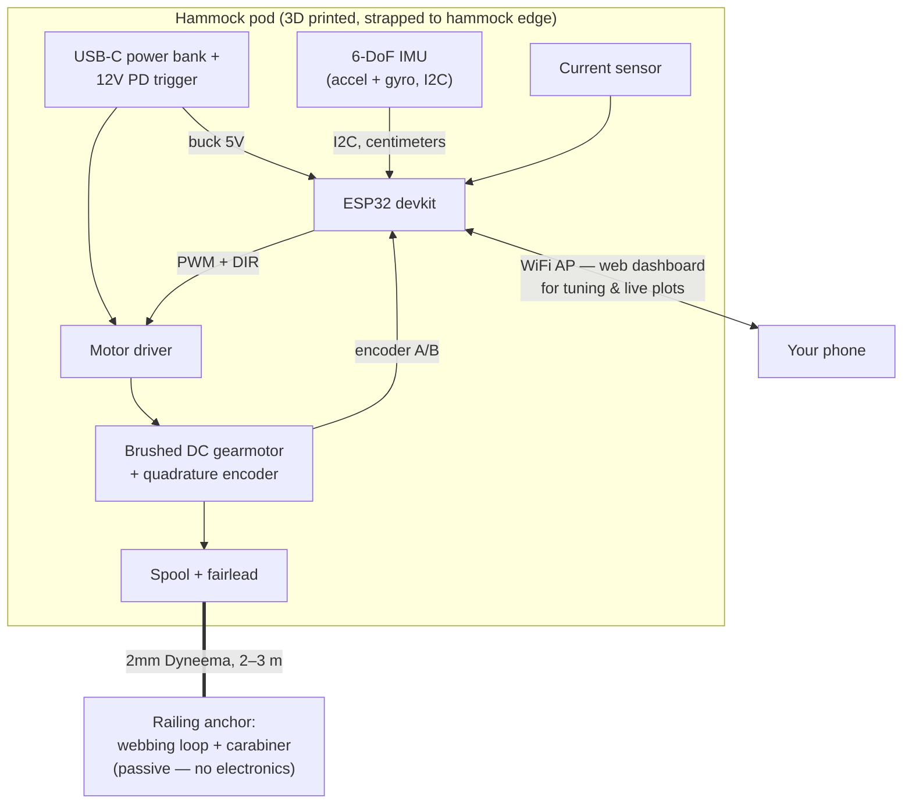

# 01 — System Overview

## The physics: you are building a swing-pusher, not a crane

A hammock with a person in it is a pendulum. Everything about this project follows from
three numbers, so let's establish them first.

### Natural period

For a pendulum of effective length `L` (suspension point to combined center of mass):

```
T = 2π √(L / g)
```

A hammock typically hangs with its center of mass 1.0–1.5 m below the anchor line, so:

| Effective length L | Period T | Frequency |
|---|---|---|
| 1.0 m | 2.0 s | 0.50 Hz |
| 1.2 m | 2.2 s | 0.45 Hz |
| 1.5 m | 2.5 s | 0.40 Hz |

The period is **independent of the occupant's weight** — a lovely property, because it
means the controller doesn't need to know who's in the hammock. It only needs to find the
period, and it can measure that directly.

### Energy required

Take a 90 kg person + hammock rocking to θ₀ = 10° (a relaxed, pleasant amplitude), L = 1.2 m:

- Height rise at the end of the swing: `h = L(1 − cos θ₀)` ≈ 18 mm
- Total swing energy: `E = mgh` ≈ 90 × 9.81 × 0.018 ≈ **16 J**
- A person-in-hammock swing decays slowly (air drag + suspension friction); the energy lost
  per cycle is only a fraction of the total — realistically **2–5 J per cycle** must be
  replaced to sustain the motion.

### Force and stroke

The hammock's horizontal excursion at ±10° is `x = L sin θ₀` ≈ ±0.21 m, so the tether pays
in and out by roughly **0.3–0.4 m each cycle** (depending on attachment geometry). To
inject ~4 J while the hammock swings toward the anchor, pulling over ~0.15–0.20 m of that
stroke:

```
F ≈ 4 J / 0.17 m ≈ 24 N   →   design for 50 N continuous, 80 N peak (comfortable margin)
```

Peak line speed (at the bottom of the swing) is `v ≈ θ₀ √(gL)` ≈ **0.6 m/s**.

**These are the design drivers: ~50 N, ~0.6 m/s, ~0.4 m of stroke, once every ~2.2 s.**
That's a few watts of mechanical power. Everything in [doc 02](02-motor-and-winch.md) is
sized from these numbers.

## How the pumping works

To add energy to a pendulum, apply force **in the direction of motion**. A tether can only
pull, so the winch (riding on the hammock, tethered to a fixed anchor):

1. **Pulls** (winds in, with the pump force) while the hammock moves *toward* the anchor.
2. **Pays out** (unwinds, keeping just enough tension that the line never goes slack) while
   the hammock moves *away*.

```
hammock position ──►  away ────────── toward ─────────── away ──────
                       ╱‾‾‾‾‾╲                 ╱‾‾‾‾‾╲
                      ╱       ╲               ╱       ╲
                     ╱         ╲_____________╱         ╲____
line tension:        [ light ]  [ PULL 30N ]  [ light ]
motor:               pay out     wind in      pay out
```

It makes no difference to the physics which end of the line the motor sits at — a winch on
the hammock reeling itself toward a fixed anchor produces exactly the same forces as a
winch on the railing reeling the hammock in. Mounting it on the hammock is what lets the
motor, IMU, controller, and battery share one enclosure and one charger.

This is exactly how you push a child on a swing: a well-timed nudge once per cycle, in
phase with the velocity. The controller's whole job is (a) knowing the phase and (b)
modulating the pull strength to hold a target amplitude. See
[doc 05](05-firmware-and-control.md).

### The key control insight: tension control is self-synchronizing

If the winch runs in *tension mode* — "always keep ~2 N on the line; when the line starts
coming back in, pull with 30 N instead" — the hammock itself dictates the timing. There is
no clock to synchronize, no phase-locked loop to tune. The encoder on the motor tells you
which way the line is moving, and that *is* the phase signal. The IMU (which rides in the
same pod, on the swinging body) then becomes a **refinement** (better amplitude estimation,
works before tension is established, detects a person climbing in/out), not a prerequisite.
This ordering is what makes the [build plan](07-build-plan.md) low-risk.

## System architecture



One battery powers everything; one USB-C port recharges it. The anchor side is dumb
hardware from the climbing aisle. Because the pod is on the swinging body, the IMU
measures the hammock's motion directly — your original design goal — while sitting
centimeters from the ESP32, so it connects over ordinary I2C with none of the
long-cable or radio-link problems a split design would have.

## Placement geometry (matters more than it looks)

- **Swing direction:** a hammock rocks *side-to-side*, perpendicular to its long axis. The
  anchor must be off to the side of the hammock, and the pod straps to the hammock's edge
  (or a ridgeline point above the occupant's hip) facing it, so the line pulls along the
  direction of swing.
- **Height:** pull as close to horizontal as you can at the hammock's resting height. A
  balcony railing (~1.0–1.1 m) and a hammock edge at 0.5–0.7 m gives a shallow angle —
  fine. Efficiency scales with the cosine of the angle between line and motion; keep it
  under ~30°. Loop the anchor strap low on the railing (around a baluster near the floor)
  if the geometry wants it.
- **Distance:** 1.5–3 m of line is the sweet spot. Too close and the line angle changes
  a lot over the stroke (nonlinear, harder on control); too far and sag/whip in the line
  gets annoying.

## Design decisions at a glance

| Decision | Choice | Rejected alternatives & why |
|---|---|---|
| Actuation | Winch (spool + line) to a fixed anchor | Crank arm: fixed stroke, can't adapt. Linear actuator: far too slow. Shifting-mass box (no tether): would need to shuttle several kg to inject the energy a 30 N tug provides — heavy and power-hungry. |
| Motor location | On the hammock, in one pod with everything else | On the railing: quieter at the ear and nothing rides on the hammock, but needs a second battery + radio for the IMU (or a failure-prone wired run), an engineered clamp with torque bracing, and a second thing to charge. The electronics are position-agnostic, so this remains a re-housing option if noise annoys. |
| Motor | Brushed DC gearmotor + encoder | Stepper: poor torque at 0.6 m/s line speed, loud, wastes hold current. BLDC + FOC: lovely but overkill complexity. Sail-winch servo: viable for a quick hack but limited travel and no torque control. |
| Gear ratio | Moderate (~30:1), backdrivable spur/helical | Worm gear: **not backdrivable** — the away-swing would jerk to a stop; also fails dangerous instead of failing soft. |
| Phase sensing | Winch encoder (primary), onboard IMU (refinement) | IMU-only: works, but the encoder is free and derisks the build. |
| IMU connection | I2C on the pod's own board stack | The split-unit designs need I2C over 2–3 m (out of spec, noisy) or a radio link — the pod layout makes the problem vanish. |
| Power | One USB-C PD power bank + 12V trigger, in the pod | Integrated 3S pack: slimmer v2, but battery management is a whole subproject; do it after the fun part works. |
