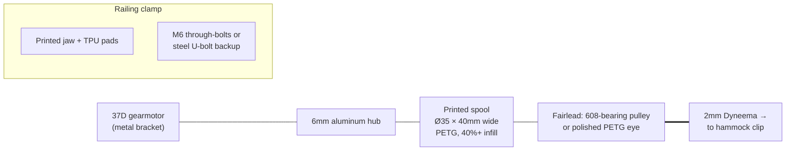

# 02 — Motor & Winch

## Requirements (derived in [doc 01](01-system-overview.md))

| Parameter | Value | Notes |
|---|---|---|
| Line force, continuous | ~50 N | pump pulls are 20–40 N; margin for heavier users / bigger amplitude |
| Line force, peak | ~80 N | brief, at start of a pull |
| Line speed, peak | ~0.6 m/s | at the bottom of the swing |
| Stroke per cycle | 0.3–0.4 m | line pays in and out this much every ~2.2 s |
| Duty | ~40% pulling, ~60% paying out | pull is roughly half of each half-cycle |
| Backdrivable | **Required** | see below — this rules out entire motor classes |

### Torque and speed at the spool

With a spool of radius `r`, line force `F` needs shaft torque `τ = F·r` and line speed `v`
needs shaft speed `ω = v/r`. The spool radius is your gearbox's final stage — pick it to
put the operating point inside the motor's happy zone:

| Spool Ø | Torque @ 50 N | RPM @ 0.6 m/s |
|---|---|---|
| 30 mm | 0.75 N·m (7.6 kg·cm) | 382 RPM |
| 35 mm | 0.88 N·m (8.9 kg·cm) | 327 RPM |
| 40 mm | 1.00 N·m (10.2 kg·cm) | 286 RPM |

Important subtlety that saves you from over-buying: **peak force and peak speed never
coincide.** The pull happens early in the toward-swing when the hammock is slow; at the
bottom of the swing (max speed) the required force is near zero, and during pay-out the
motor is lightly back-driven. So the motor needs to reach ~330 RPM *unloaded-ish* and
produce ~9 kg·cm *at low speed* — it does not need 9 kg·cm at 330 RPM simultaneously.

## ⭐ Recommended motor

**[Pololu 37D 30:1 12V metal gearmotor with 64 CPR encoder](https://www.pololu.com/category/116/37d-metal-gearmotors)** — get the **helical-pinion** variant (quieter; this is a
relaxation device, gear whine matters).

Specs (12 V): ~330 RPM no-load, stall torque ~14 kg·cm, stall current ~5.5 A, recommended
continuous load ~10 kg·cm. With a Ø35 mm spool that's ~79 N of stall-force headroom and
~0.6 m/s of line speed — exactly on target. The integrated encoder (64 CPR at the motor,
~1920 counts/rev at the output, ~57 counts/mm of line, i.e. **sub-millimeter line position
resolution**) is what makes the "encoder as hammock sensor" strategy work; do not buy the
encoder-less version to save $10.

If you expect heavy users, big amplitudes, or a steep line angle, the
[50:1 version](https://www.pololu.com/product-info-merged/4753) trades top speed
(200 RPM → 0.37 m/s on a Ø35 spool — use a Ø45–50 mm spool with it) for 50% more torque.
For a first build the 30:1 is the better-balanced choice.

Buy with it: Pololu's **stamped 37D mounting bracket** and a **6 mm universal aluminum
mounting hub** — printed motor mounts and printed shaft couplings are the two most common
sources of wobble and slop; $12 of metal removes both.

### Budget alternative (~$15)

**JGB37-520 12V with hall encoder, 12–15 kg·cm rated, 320–450 RPM class** (AliExpress/
Amazon, many listings). Same 37 mm form factor, noticeably louder and looser gear train,
encoder resolution varies by listing (typically 11 PPR motor-side — still plenty through
the gearbox). Totally serviceable for prototyping; you can swap in the Pololu later since
mounting is near-identical.

### Why not a stepper, servo, or BLDC?

- **Stepper (NEMA 17/23):** torque collapses with speed; a NEMA 17 delivering 0.75 N·m at
  330 RPM basically doesn't exist at hobby prices, you'd need a gearbox anyway, it hums
  audibly, and it burns holding current all the time on battery. Wrong tool.
- **Hobby servo (incl. sail-winch servo):** a multi-turn sail winch servo could do a crude
  version (it's the "weekend hack" path), but you get position-only control — no torque/
  tension mode — limited travel (~0.5–0.8 m), and no encoder feedback for sensing. Dead end
  for the control strategy this project wants.
- **BLDC + FOC (ODrive/SimpleFOC/hoverboard motor):** genuinely excellent (silent, true
  torque control) and a lovely v3 upgrade, but it triples electronics complexity and cost
  for a v1.

### ⚠️ The backdrivability rule (do not skip)

During the away-swing the hammock pulls line off the spool against light motor resistance.
If the gearbox cannot be driven backwards from the output side, the line instead snaps taut
and yanks the hammock to a halt — unpleasant at best. **Never use a worm-gear motor**, and
be cautious above ~100:1 spur ratios (friction makes them effectively one-way). The 30:1
spur/helical gearbox back-drives easily. This also gives you a graceful failure mode: if
power dies mid-pull, the occupant's momentum just unspools some line against a dead motor
— a soft stop, not a wall.

## Motor driver

**Recommended: [Cytron MD13S](https://www.cytron.io/p-13amp-6v-30v-dc-motor-driver)**
(~$12) — 13 A continuous, 6–30 V, locked-antiphase or sign-magnitude PWM up to 20 kHz,
robust against the inductive abuse a winch dishes out, and has a handy manual test button.

Cheaper alternative: **BTS7960 "IBT-2" module** (~$8) — massively overspecced current-wise,
works fine, bulkier, and its current-sense (IS) pins are crude but usable.

Avoid: DRV8871/L298N-class drivers. The 37D stalls at 5.5 A; a 3.6 A driver will hit
current-chop right when you need peak force, and the L298N is a museum piece that drops
~2 V.

Drive PWM at **≥20 kHz** so the motor doesn't whine in the audible range.

## Current sensing

Add an **ACS712-20A or ACS723-10A hall current module** (~$4) in the motor supply line.
It gives you:
- Line-tension estimation (`F ≈ (τ/r) = k_t·I / r` minus friction) — the input to tension
  control and the pump-force limit.
- Stall/overload detection (safety cutoff).
- "Someone unclipped the line" detection (current at speed with no load looks distinctive).

## Winch mechanics (3D-printed parts)

- **Spool:** Ø35 mm core, ~40 mm wide, tall flanges (Ø70 mm+). A wide spool keeps 3 m of
  2 mm line in 1–2 layers, so the effective radius (and your counts→mm calibration) stays
  nearly constant. Print in PETG, 6+ walls; bolt it to the aluminum hub rather than
  trusting a printed D-bore. Drill a small hole in the core to anchor the line with a
  stopper knot **plus** leave 3 wraps of line on the spool at max extension — wraps, not
  the knot, carry the load (capstan effect).
- **Fairlead:** the line must leave the spool toward the hammock at a changing angle as
  the hammock swings. A small pulley on a 608 bearing (printed sheave) as the last guide
  point handles this with minimal friction and keeps the line off the enclosure edges.
- **Railing clamp:** print a two-jaw clamp with TPU pads, closed by two M6 bolts with wing
  nuts. The load is only ~80 N but it's *cyclic at 0.45 Hz for hours* — printed clamps
  loosen by creep and walking. Add a **steel U-bolt or two hose clamps as the
  primary structural path** and let the printed part do positioning/anti-rotation. Point
  the winch so the line load pulls the clamp *into* the railing, not along it.
- **Torque reaction:** 1 N·m at the motor becomes a twisting moment on the clamp each
  pull; brace the motor bracket back to the clamp body, not just to the enclosure shell.
- **Enclosure:** this lives outdoors on a balcony. Ventilated but rain-shadowed (motor
  needs airflow, electronics need a splash guard), drain holes at the bottom, connectors
  facing down. Bring it inside when not in use — don't design for permanent weather
  exposure in v1.
