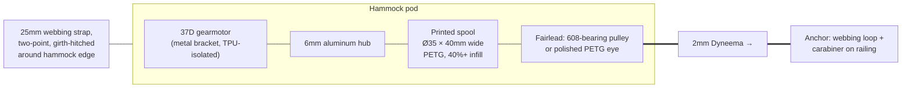

# 02 — Motor & Winch

## Requirements (derived in [doc 01](01-system-overview.md))

| Parameter | Value | Notes |
|---|---|---|
| Line force, continuous | ~50 N | pump pulls are 20–40 N; margin for heavier users / bigger amplitude |
| Line force, peak | ~80 N | brief, at start of a pull |
| Line speed, peak | ~0.6 m/s | at the bottom of the swing |
| Stroke per cycle | 0.3–0.4 m | line pays in and out this much every ~2.2 s |
| Duty | ~40% pulling, ~60% paying out | pull is roughly half of each half-cycle |
| Backdrivable | **Required** | see below — this rules out entire motor classes |
| Weight & noise | Matters | the whole winch rides on the hammock, ~0.5 m from the occupant |

### Torque and speed at the spool

With a spool of radius `r`, line force `F` needs shaft torque `τ = F·r` and line speed `v`
needs shaft speed `ω = v/r`. The spool radius is your gearbox's final stage — pick it to
put the operating point inside the motor's happy zone:

| Spool Ø | Torque @ 50 N | RPM @ 0.6 m/s |
|---|---|---|
| 30 mm | 0.75 N·m (7.6 kg·cm) | 382 RPM |
| 35 mm | 0.88 N·m (8.9 kg·cm) | 327 RPM |
| 40 mm | 1.00 N·m (10.2 kg·cm) | 286 RPM |

Important subtlety that saves you from over-buying: **peak force and peak speed never
coincide.** The pull happens early in the toward-swing when the hammock is slow; at the
bottom of the swing (max speed) the required force is near zero, and during pay-out the
motor is lightly back-driven. So the motor needs to reach ~330 RPM *unloaded-ish* and
produce ~9 kg·cm *at low speed* — it does not need 9 kg·cm at 330 RPM simultaneously.

## ⭐ Recommended motor

**[Pololu 37D 30:1 12V metal gearmotor with 64 CPR encoder](https://www.pololu.com/category/116/37d-metal-gearmotors)** — get the **helical-pinion** variant. It's a few dB quieter
than the spur version, and since this motor runs half a meter from a person trying to
relax, quietness is a first-class spec, not a nicety.

Specs (12 V): ~330 RPM no-load, stall torque ~14 kg·cm, stall current ~5.5 A, recommended
continuous load ~10 kg·cm, mass ~200 g. With a Ø35 mm spool that's ~79 N of stall-force
headroom and ~0.6 m/s of line speed — exactly on target. The integrated encoder (64 CPR at
the motor, ~1920 counts/rev at the output, ~57 counts/mm of line, i.e. **sub-millimeter
line position resolution**) is what makes the "encoder as hammock sensor" strategy work;
do not buy the encoder-less version to save $10.

If you expect heavy users, big amplitudes, or a steep line angle, the
[50:1 version](https://www.pololu.com/product-info-merged/4753) trades top speed
(200 RPM → 0.37 m/s on a Ø35 spool — use a Ø45–50 mm spool with it) for 50% more torque.
For a first build the 30:1 is the better-balanced choice.

Buy with it: Pololu's **stamped 37D mounting bracket** and a **6 mm universal aluminum
mounting hub** — printed motor mounts and printed shaft couplings are the two most common
sources of wobble and slop; $12 of metal removes both.

### Budget alternative (~$15)

**JGB37-520 12V with hall encoder, 12–15 kg·cm rated, 320–450 RPM class** (AliExpress/
Amazon, many listings). Same 37 mm form factor, noticeably louder and looser gear train —
which matters more in this design than it would railing-mounted — encoder resolution varies
by listing (typically 11 PPR motor-side, still plenty through the gearbox). Serviceable for
prototyping; you can swap in the Pololu later since mounting is near-identical.

### Why not a stepper, servo, or BLDC?

- **Stepper (NEMA 17/23):** torque collapses with speed; a NEMA 17 delivering 0.75 N·m at
  330 RPM basically doesn't exist at hobby prices, you'd need a gearbox anyway, it hums
  audibly, and it burns holding current all the time on battery. Wrong tool.
- **Hobby servo (incl. sail-winch servo):** a multi-turn sail winch servo could do a crude
  version (it's the "weekend hack" path), but you get position-only control — no torque/
  tension mode — limited travel (~0.5–0.8 m), and no encoder feedback for sensing. Dead end
  for the control strategy this project wants.
- **BLDC + FOC (ODrive/SimpleFOC/hoverboard motor):** genuinely excellent — silent and
  true torque control, which is extra tempting with the motor near your ear — but it
  triples electronics complexity and cost. A lovely v3 upgrade, not a v1.

### ⚠️ The backdrivability rule (do not skip)

During the away-swing the hammock (with the pod on it) moves away from the anchor and pulls
line off the spool against light motor resistance. If the gearbox cannot be driven
backwards from the output side, the line instead snaps taut and yanks the hammock to a halt
— unpleasant at best. **Never use a worm-gear motor**, and be cautious above ~100:1 spur
ratios (friction makes them effectively one-way). The 30:1 spur/helical gearbox back-drives
easily. This also gives you a graceful failure mode: if power dies mid-pull, the swing just
unspools line against a dead motor — a soft stop, not a wall.

## Motor driver

**Recommended: [Cytron MD13S](https://www.cytron.io/p-13amp-6v-30v-dc-motor-driver)**
(~$12) — 13 A continuous, 6–30 V, locked-antiphase or sign-magnitude PWM up to 20 kHz,
robust against the inductive abuse a winch dishes out, and has a handy manual test button.

Cheaper alternative: **BTS7960 "IBT-2" module** (~$8) — massively overspecced current-wise,
works fine, bulkier, and its current-sense (IS) pins are crude but usable.

Avoid: DRV8871/L298N-class drivers. The 37D stalls at 5.5 A; a 3.6 A driver will hit
current-chop right when you need peak force, and the L298N is a museum piece that drops
~2 V.

Drive PWM at **≥20 kHz** so the motor doesn't whine in the audible range.

## Current sensing

Add an **ACS712-20A or ACS723-10A hall current module** (~$4) in the motor supply line.
It gives you:
- Line-tension estimation (`F ≈ (τ/r) = k_t·I / r` minus friction) — the input to tension
  control and the pump-force limit.
- Stall/overload detection (safety cutoff).
- "Line unclipped/snapped" detection (current at speed with no load looks distinctive).

## Pod mechanics (3D-printed parts)

- **Spool:** Ø35 mm core, ~40 mm wide, tall flanges (Ø70 mm+). A wide spool keeps 3 m of
  2 mm line in 1–2 layers, so the effective radius (and your counts→mm calibration) stays
  nearly constant. Print in PETG, 6+ walls; bolt it to the aluminum hub rather than
  trusting a printed D-bore. Drill a small hole in the core to anchor the line with a
  stopper knot **plus** leave 3 wraps of line on the spool at max extension — wraps, not
  the knot, carry the load (capstan effect).
- **Fairlead:** the line must leave the pod toward the anchor at a slightly changing angle
  as the hammock swings. A small pulley on a 608 bearing (printed sheave) as the exit point
  handles this with minimal friction and keeps the line off the enclosure edges. The spool
  and fairlead must be **fully enclosed** except for the line exit slot — this winch
  operates next to a person ([doc 08](08-safety.md)).
- **Attaching the pod to the hammock:** see the dedicated section below — it's the most
  design-sensitive interface in the project.
- **The anchor (railing side):** completely passive — a 25 mm webbing loop around a railing
  baluster or post, closed with a small locking carabiner, line tied to it (figure-8 on a
  bight). ~$6, no printing, no torque bracing, nothing to engineer. Bonus: loop it around a
  tree, fence, or wall hook and the device works anywhere. Confirm the railing member is
  sound; the load is only ~80 N.
- **Noise & vibration (the tax for pod-mounting):** mount the motor bracket to the
  enclosure through **TPU grommets/washers**, don't let the spool flanges touch the shell,
  keep enclosure walls thick (they drum when thin), and use the helical gearbox + 20 kHz
  PWM. Expectation: a soft whirr for ~1 s of every ~2.2 s cycle, at your hip. If it bothers
  you in practice, the identical electronics re-house into a railing-mounted box (with a
  clamp) without any redesign — that's the escape hatch, not a reason to split the system
  preemptively.
- **Enclosure:** ventilated but splash-shadowed, USB-C charge port and power switch facing
  down/inboard, strap slots reinforced (print orientation matters — load along layers, not
  across). Bring it inside when not in use; don't design for permanent weather exposure in
  v1.

## Attaching the pod to the hammock fabric

This is the most design-sensitive interface in the project, so it gets its own section.
The requirements: carry ~80 N of cyclic pull (shear, along the fabric) plus the pod's
~0.7 kg (gravity), on any hammock, without sewing, without damaging the fabric, with a
failure mode that announces itself before letting go.

### The load analysis that rules things in and out

The pull force runs *along* the fabric plane — it's a **shear** load, arriving as a tug
every 2.2 s, thousands of times per session. Two families of grip exist:

- **Friction grips** (anything that squeezes the fabric flat between two surfaces —
  magnets, smooth clamp plates, spring clips): shear capacity = friction coefficient ×
  clamp force. To hold 80 N at μ ≈ 0.6 you need ~130 N of *sustained* clamping, and cyclic
  tugs make friction grips migrate ("walk") long before outright slip.
- **Geometric interlocks** (anything the fabric wraps around so the load path is fabric
  tension, not surface friction — hitches, buttons, toothed jaws): capacity is set by the
  fabric itself, and most tighten under load instead of loosening.

Use an interlock for the load. Every option below is one.

### ⭐ Recommended: two "button anchors" + webbing to the pod

The classic no-sew way to grab fabric mid-panel (borrowed from tarp buttons / garter
clips): push a **smooth printed dome (Ø30 mm, generous fillets, PETG)** up under the
fabric, and snap a **printed collar ring** over the neck of fabric that forms around it.
The fabric necks around the button and the grip is geometric — *the harder the pull, the
tighter it holds*. Tarp versions hold tens of kilograms on ripstop nylon without damage.

- Place **two buttons ~10 cm apart** at the hammock edge nearest the anchor, at hip
  height; short webbing from each collar to the pod's two strap slots. Two points are what
  react the motor's ~1 N·m torque pulse — a single-point mount nods at every tug.
- Attaches anywhere on any fabric hammock (mid-panel included), removable in seconds,
  nothing sharp, nothing sewn.
- Design the collar snap so it *cannot* pop off under line-direction load (load the neck,
  not the snap), and radius everything the fabric touches — a 3D printer earns its keep
  here.
- Fails gracefully: overload stretches fabric around the button and slips it out at loads
  far above ours (and far below fabric tear strength), rather than releasing suddenly.

### Also good: girth hitch around the bunched edge

Gather a hand-width of the hammock's edge fabric into a bunch and girth-hitch a 25 mm
webbing loop around it, through the pod's strap slots. The edge is the strongest part of
the hammock — it already carries the occupant — and the hitch tightens under load. Zero
printed parts; works on all gathered-end hammocks; slightly less placement freedom than
buttons and a bit lumpier under the hip. On ultralight nylon, pad under the hitch.

**Pragmatic plan:** print the buttons, pack the webbing loop as the universal fallback,
and let Phase 2 testing pick the winner for your hammock.

### About magnets (the tempting wrong tool for the load path)

Magnets clamping the fabric between the two housing parts is appealing — self-aligning,
tool-free, satisfying clunk — but they're a **friction grip loaded in shear**:

- Through two layers of fabric, a neodymium pair loses roughly a third to half of its
  rated force (magnet force falls off steeply with gap). Getting a *sustained* ~130 N of
  clamp means four or more large N52 discs (~60 g and real pinch hazards).
- The failure sequence under cyclic tugs is walk → slip → peel — and peel unzips a magnet
  array almost instantly. It fails **suddenly and silently**, dropping a live winch onto
  the occupant; webbing fails **slowly and visibly** (fraying you catch at setup
  inspection, [doc 08](08-safety.md)). For human-attached hardware, always choose the
  second failure mode.

Where magnets *do* belong: the **convenience layer**. A pair of small discs (e.g. 10×3 mm)
in the pod shell mating with a thin printed backing plate through the fabric will hold the
pod flat and rattle-free against the hammock body — alignment and anti-flop while the
buttons/strap carry every newton of load. Nice-to-have, not structural; add it in Phase 4
if the pod fidgets.
