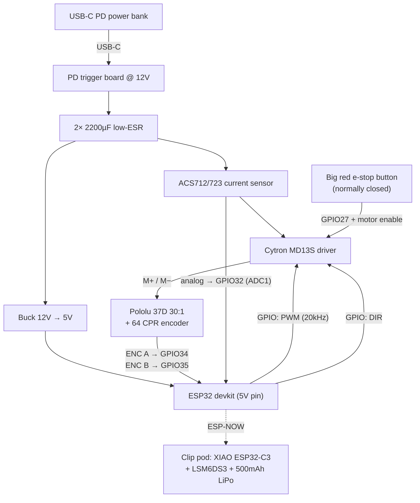

# 04 — Electronics & Power

## Controller: plain ESP32 devkit

An **ESP32-WROOM-32 devkit** (~$6–8) is the right brain for the railing unit:

- **PCNT** peripheral decodes the quadrature encoder in hardware (no interrupt jitter).
- **MCPWM/LEDC** does 20 kHz motor PWM in hardware.
- **ESP-NOW** receives the clip's IMU packets with ~1 ms latency.
- **WiFi AP + web server** — as a software person you'll get enormous mileage from a
  self-hosted dashboard (live phase/amplitude plots, gain sliders, start/stop). This is
  the single best debugging investment in the project.

An ESP32-S3 also works (nicer USB); avoid the ESP32-C3 *for the main unit* — fewer
peripherals/pins, and no dual core (nice to pin the 200 Hz control loop to core 1 and let
WiFi live on core 0).

## Power architecture

The motor wants ~12 V with 3–5 A peaks; logic wants 5 V/3.3 V; and the whole thing must be
USB-rechargeable. Two sane paths:

### ⭐ Option A (v1): USB-C PD power bank + 12 V trigger board

Buy nothing battery-shaped. A **USB-C PD power bank (30 W or better)** plus a **USB-C PD
trigger/decoy board set to 12 V** (~$4) gives you: a certified, protected, thermally
managed battery; recharging over USB-C (your requirement, verbatim); a removable/swappable
pack; and no lithium handling on your bench.

Design notes for making a power bank happy driving a motor:

- **Peaks:** firmware caps motor current at ~2.2 A @ 12 V (≈26 W) so a 30 W bank never
  sees an over-current transient; add **2× 2200 µF low-ESR electrolytics** across the
  driver's supply to absorb pull-start inrush. If you buy a 45–65 W bank you can raise the
  cap. (Full stall of the 37D is 5.5 A ≈ 66 W — the firmware current limit is what keeps
  this workable; see [doc 05](05-firmware-and-control.md).)
- **Auto-sleep:** banks switch off under light load, but the motor pulses every ~2.2 s keep
  it awake; the idle state may need a tiny keep-alive pulse (or you accept pressing the
  bank's button to start a session).
- **Energy budget:** rocking averages ~3–6 W → a 10,000 mAh (37 Wh) bank ≈ **6–10 hours**
  of continuous rocking.

### Option B (v2): integrated 3S Li-ion pack

When you want a sealed, single-cable product: **3× 18650 in 3S** (11.1 V nominal, fits the
12 V motor perfectly), a **3S BMS board** (protection + balance), charged from USB-C via a
**PD trigger at 15 V feeding a CC/CV buck charger module set to 12.6 V** (CN3722-based
modules are the common maker choice) — or one of the integrated "3S USB-C charger BMS"
boards from the usual suspects. This is a fine, well-trodden path; it's just a subproject
(cell holders vs. spot welding, charge termination checking, fusing) that shouldn't gate
the fun part. Battery cautions in [doc 08](08-safety.md).

### Logic rail

A small **synchronous buck module 12 V → 5 V, 2–3 A** ("Mini560" class, ~$3) feeding the
devkit's 5 V pin. Don't feed the devkit's linear regulator from 12 V directly (it'll cook),
and don't power the ESP32 from the same rail as the motor without the buck in between —
brownout resets mid-pull are a classic gearmotor-project rite of passage. Add a 470 µF cap
on the 5 V rail.

## Wiring diagram

Wiring notes:

- Encoder A/B on **input-only GPIOs 34/35** (no boot-strap surprises); encoder VCC is
  3.3 V-friendly on the Pololu (it accepts 3.5–20 V and outputs at VCC — power it from
  3.3 V so the ESP32 sees safe levels).
- Current sensor on an **ADC1** pin — ADC2 fights with WiFi on ESP32.
- Route the **e-stop through the driver's enable line in hardware**, not only through
  firmware, so a hung control loop can't keep pulling ([doc 08](08-safety.md)).
- Twist the motor leads, keep them away from the encoder pair, and star-ground at the
  driver. The clip is wireless, so the noisiest wiring stays inside one small box.
- Add a simple voltage divider from the 12 V rail to an ADC pin for battery telemetry on
  the dashboard.

## Clip pod electronics (recap from [doc 03](03-sensing-and-tether.md))

XIAO ESP32-C3 + LSM6DS3 breakout over I2C (a *centimeter* of I2C — totally fine) + 500 mAh
LiPo on the XIAO's battery pads (it has charging built in) + slide switch. Alternative:
XIAO nRF52840 Sense collapses IMU + charger onto one board and multiplies battery life;
choose it if you're comfortable writing a BLE notify link instead of ESP-NOW.
