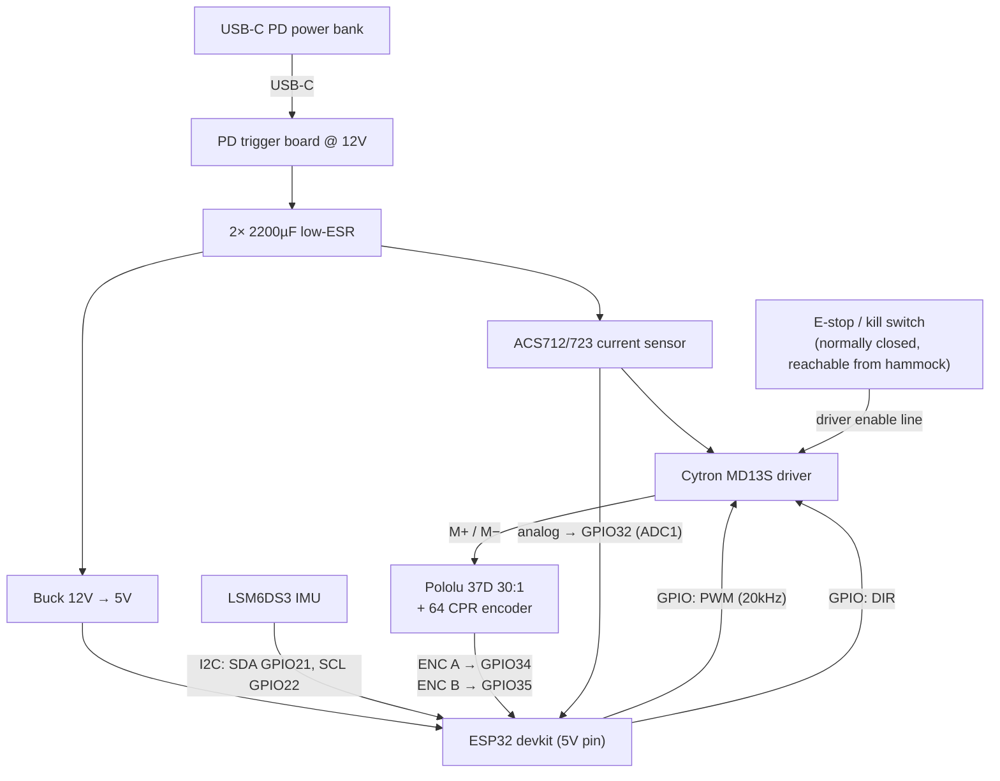

# 04 — Electronics & Power

Everything electronic lives in the one pod on the hammock: ESP32, IMU, motor driver,
current sensor, and a single battery. One USB-C port charges the whole device.

## Controller: plain ESP32 devkit

An **ESP32-WROOM-32 devkit** (~$6–8) is the right brain:

- **PCNT** peripheral decodes the quadrature encoder in hardware (no interrupt jitter).
- **MCPWM/LEDC** does 20 kHz motor PWM in hardware.
- **I2C** reads the IMU sitting centimeters away on the same board stack.
- **WiFi AP + web server** — as a software person you'll get enormous mileage from a
  self-hosted dashboard (live phase/amplitude plots, gain sliders, start/stop). This is
  the single best debugging investment in the project.

An ESP32-S3 also works (nicer USB); avoid the ESP32-C3 — fewer peripherals/pins, and no
dual core (nice to pin the 200 Hz control loop to core 1 and let WiFi live on core 0).

## IMU

**LSM6DS3 / LSM6DSO breakout** (~$6; an MPU-6050 also works and is even cheaper). I2C to
the ESP32, mounted on foam/TPU standoffs away from the motor bracket
([doc 03](03-sensing-and-tether.md)). At 3.3 V it draws ~1 mA — a rounding error in the
power budget.

## Power architecture

The motor wants ~12 V with 3–5 A peaks; logic wants 5 V/3.3 V; the whole thing must be
USB-rechargeable — and now it must also be carried by the hammock, so weight joins the
criteria. Two sane paths:

### ⭐ Option A (v1): compact USB-C PD power bank + 12 V trigger board

Buy nothing battery-shaped. A **compact USB-C PD power bank (30 W or better)** plus a
**USB-C PD trigger/decoy board set to 12 V** (~$4) gives you: a certified, protected,
thermally managed battery; recharging over USB-C (your requirement, verbatim); and a
swappable pack. A 10,000 mAh bank weighs ~180–210 g; a 5,000 mAh one ~110–130 g if you
want to shave pod weight and accept half the runtime.

Design notes for making a power bank happy driving a motor:

- **Peaks:** firmware caps motor current at ~2.2 A @ 12 V (≈26 W) so a 30 W bank never
  sees an over-current transient; add **2× 2200 µF low-ESR electrolytics** across the
  driver's supply to absorb pull-start inrush. If you buy a 45–65 W bank you can raise the
  cap. (Full stall of the 37D is 5.5 A ≈ 66 W — the firmware current limit is what keeps
  this workable; see [doc 05](05-firmware-and-control.md).)
- **Auto-sleep:** banks switch off under light load, but the motor pulses every ~2.2 s keep
  it awake; the idle state may need a tiny keep-alive pulse (or you accept pressing the
  bank's button to start a session).
- **Energy budget:** rocking averages ~3–6 W → 10,000 mAh (37 Wh) ≈ **6–10 hours** of
  continuous rocking; 5,000 mAh ≈ 3–5 hours.

### Option B (v2): integrated 3S Li-ion pack

When you want a slimmer, sealed pod: **3× 18650 in 3S** (11.1 V nominal, ~150 g of cells,
fits the 12 V motor perfectly), a **3S BMS board** (protection + balance), charged from
USB-C via a **PD trigger at 15 V feeding a CC/CV buck charger module set to 12.6 V**
(CN3722-based modules are the common maker choice) — or one of the integrated "3S USB-C
charger BMS" boards from the usual suspects. A fine, well-trodden path; it's just a
subproject (cell holders vs. spot welding, charge termination checking, fusing) that
shouldn't gate the fun part. Battery cautions in [doc 08](08-safety.md).

### Logic rail

A small **synchronous buck module 12 V → 5 V, 2–3 A** ("Mini560" class, ~$3) feeding the
devkit's 5 V pin. Don't feed the devkit's linear regulator from 12 V directly (it'll cook),
and don't power the ESP32 from the same rail as the motor without the buck in between —
brownout resets mid-pull are a classic gearmotor-project rite of passage. Add a 470 µF cap
on the 5 V rail.

## Weight budget (it rides with you)

| Item | ~Mass |
|---|---|
| Motor + bracket + hub | 240 g |
| Power bank (10,000 mAh) | 200 g |
| ESP32 + driver + IMU + sensor + buck + caps + wiring | 80 g |
| Spool, fairlead, enclosure, strap, hardware | 180 g |
| **Total** | **~700 g** (≈550 g with a 5,000 mAh bank) |

About a full water bottle clipped at your hip — the hammock won't notice (it's <1% of the
occupant mass, so it doesn't measurably change the pendulum either).

## Wiring diagram

Wiring notes:

- Encoder A/B on **input-only GPIOs 34/35** (no boot-strap surprises); power the Pololu
  encoder from 3.3 V (it accepts 3.5–20 V and outputs at VCC — 3.3 V keeps the ESP32 pins
  safe; it runs fine there in practice, or use a level shifter from 5 V if yours is
  marginal).
- Current sensor on an **ADC1** pin — ADC2 fights with WiFi on ESP32.
- Route the **e-stop through the driver's enable line in hardware**, not only through
  firmware, so a hung control loop can't keep pulling ([doc 08](08-safety.md)). Since the
  pod is on the hammock, the kill switch is naturally within the occupant's reach — one of
  the quiet safety wins of this layout.
- Twist the motor leads, keep them away from the encoder pair and the IMU, star-ground at
  the driver.
- Add a simple voltage divider from the 12 V rail to an ADC pin for battery telemetry on
  the dashboard.
