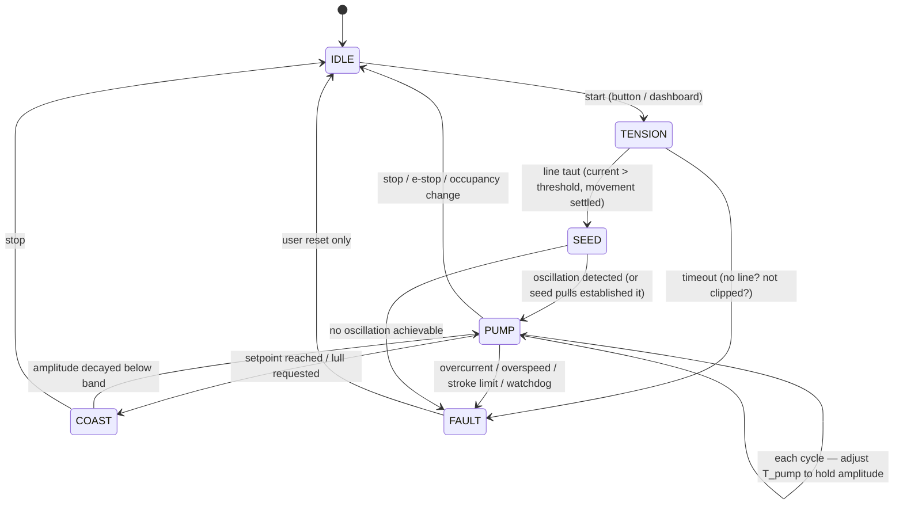

# 05 — Firmware & Control

This is the part of the project where your software background is the superpower. The
mechanics are modest; the product lives or dies on how the pull *feels*.

## Stack

- **PlatformIO + Arduino-ESP32** (or ESP-IDF if you prefer): mature encoder (PCNT) and
  PWM (LEDC/MCPWM) support, I2C, async web server.
- Control loop at **200–500 Hz** pinned to core 1; WiFi/dashboard/telemetry on core 0.
- A **web dashboard** (ESP32 as AP, WebSocket streaming) from day one: live plots of line
  position, velocity, current, phase state, and sliders for gains. You will tune 10× faster
  with plots than with a serial console.

## Signals

| Signal | Source | Used for |
|---|---|---|
| Line position `x` (mm) | Encoder counts × calibration | Amplitude, stroke limits |
| Line velocity `v` (mm/s) | Filtered derivative of `x` | **Phase** (sign of v), pump timing |
| Motor current `I` | ACS712 via ADC | Tension estimate, force limit, fault detection |
| Swing rate `ω` | Onboard IMU gyro (Phase 3+) | Phase before tension exists, amplitude, occupancy |
| Tilt/accel | Onboard IMU accel | "Person climbing in/out" detection, absolute amplitude |

## The control law: tension-mode pumping

Think of the motor as a programmable tension source, not a position actuator:

```
every tick:
    estimate tension from current (minus friction/inertia feedforward)
    if line velocity < 0 (hammock approaching):        # PULL window
        tension_target = T_pump        # e.g. 25–35 N, ramped up/down over ~150 ms
    else:                                              # PAY-OUT window
        tension_target = T_idle        # e.g. 2–4 N, just enough to avoid slack
    PWM = PI(tension_target - tension_estimate), clamped by I_max and v_max
```

Because the pull window is defined by *the hammock's own measured motion*, the system is
**self-synchronizing** — it phase-locks the way a person pushing a swing does, with no
explicit frequency estimation needed. Two refinements make it feel good:

1. **Ramp the pump tension** (quarter-sine ramps, ~150 ms) instead of stepping it — this
   is the difference between "gentle push" and "being yanked."
2. **End the pull early** — stop pumping at ~70–80% of the toward-swing and drop to
   `T_idle` before the direction reverses, so the reversal is always against light tension.

### Amplitude regulation (outer loop)

Measure peak-to-peak line travel per cycle (`stroke`). Run a slow PI (once per cycle) on
`T_pump` to hold `stroke` at the user's setpoint, e.g. 300 mm. Clamp `T_pump` to the safety
maximum. Result: heavier user or windy day → automatically pulls a bit harder; someone
drags a foot → backs off. Weight-independence falls out naturally.

### Slack: the failure mode to design against

If the line goes slack during pay-out, the next pull *snaps* it taut — bad feel, spike
loads. Defenses, in order: keep `T_idle > 0` always (never coast to zero PWM while paying
out); cap pay-out velocity error so the spool never over-runs; on any detected slack
(current ≈ 0 while spooling in), re-tension slowly before resuming pumping.

## State machine



- **TENSION:** wind in slowly until current says taut; record this as `x = 0` reference.
- **SEED:** if the hammock is still, a stationary tug produces no oscillation to lock
  onto. Seed by pulling at the *estimated* natural frequency (start at 0.45 Hz, sweep
  0.3–0.6 Hz) with small strokes until the encoder shows growing oscillation, then hand
  over to the self-synchronizing pump. Once the IMU is integrated (Phase 3), skip the
  sweep: any residual micro-swing gives the gyro a phase to start from.
- **Occupancy change:** the IMU (riding on the hammock with the pod) sees the large
  transient of someone climbing in/out → immediately drop to `T_idle`, return to IDLE,
  require explicit restart. (Without the IMU: a step change in mean line position +
  current signature works but is cruder — a real robustness argument for Phase 3.)

## Safety in firmware (mirrors [doc 08](08-safety.md))

- Hard clamps evaluated every tick, outside the controller: `I_max` (force),
  `v_max` (line speed), `x` inside `[x_min, x_max]` (stroke window), all trip → FAULT.
- Hardware watchdog; a hung loop de-asserts the driver enable pin (pull-down so a crashed
  ESP32 releases the motor).
- FAULT requires human reset — no auto-retry into a person.

## IMU integration (Phase 3)

The IMU is on the pod's own I2C bus — read it directly at 50–100 Hz in the control task.
Two firmware notes:

- **Vibration rejection:** the IMU shares a box with a gearmotor, but the signals live in
  different worlds — the swing is at 0.45 Hz, gear/motor vibration is >50 Hz. A low-pass
  filter (even a simple 2 Hz single-pole IIR on gyro and accel) separates them cleanly.
  Verify on the dashboard plots: the filtered gyro trace should be a clean sinusoid while
  the motor pulls.
- **Fusion:** treat the IMU as advisory on top of the encoder — use gyro phase for
  startup and cross-checking, accel for amplitude and occupancy transients, and fall back
  to encoder-only if the IMU ever misbehaves. Complementary filter is plenty; save the
  Kalman rabbit hole for v3.

## Tuning plan (bench, before any human)

1. Hang a **20 kg sandbag/water-jug pendulum** from a broomstick between two chairs at
   L ≈ 1.2 m. This is your hammock simulator; tune everything here first.
2. Calibrate encoder counts→mm (pull out 1 m, read counts) and current→tension (hang known
   weights from the line over the fairlead).
3. Verify tension mode: line should feel like a light fishing reel drag when you pull it
   out by hand, in every state, always.
4. Tune the pump on the sandbag: watch stroke converge to setpoint; adjust ramps for
   smoothness; try to make it misbehave (grab the line, let it slack, stop it mid-pull) —
   every abuse should end in a soft state, not a lurch.
