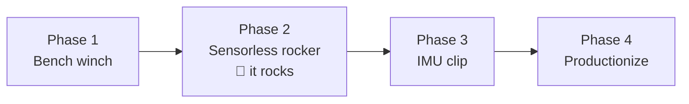

# 07 — Build Plan

Ordered to put the highest-risk, highest-learning steps first, and to reach "it rocks!"
as early as possible. Each phase has an exit test — don't move on until it passes.

## Phase 0 — Order & print (weekend 0)

Order the Phase 1–2 BOM ([doc 06](06-bill-of-materials.md)). While shipping: print the
spool, fairlead, and a first railing clamp; measure your actual hammock (swing period with
you in it — phone stopwatch, 10 swings ÷ 10; height of attachment point; distance to
railing) and sanity-check against [doc 01](01-system-overview.md).

## Phase 1 — Bench winch (weekend 1–2)

Assemble motor + driver + ESP32 + current sensor on the bench, powered by the PD trigger.

Build the firmware skeleton: encoder readout, 20 kHz PWM, current ADC, the web dashboard
with live plots, and **tension mode** (the light-fishing-reel-drag behavior).

**Exit test:** with the winch clamped to a table, you can pull line out by hand and it
always resists with a smooth, constant, gentle tension — in every state, including after
abuse (yank it, slack it, hold it). Calibrations done: counts→mm, current→newtons
(hang known weights). Firmware current/speed/stroke clamps demonstrably trip.

## Phase 2 — Sensorless rocker 🎉 (weekend 2–3)

The payoff phase. Build the sandbag pendulum (20 kg jug, L ≈ 1.2 m) and implement the
pump state machine from [doc 05](05-firmware-and-control.md) using **encoder-only**
sensing.

Then clamp to the railing and graduate to the real hammock — first with the sandbag *in
the hammock*, then a consenting adult, at half-force, e-stop within reach.

**Exit test:** hammock with occupant reaches and holds the amplitude setpoint within ~10
cycles; pulls feel like a gentle push, not a tug; grabbing the hammock mid-cycle or
stopping it dead ends in a soft FAULT/re-seed, never a lurch; a full session runs off the
power bank.

*You now have a working product. Phases 3–4 are refinement.*

## Phase 3 — IMU clip pod (weekend 4)

Build the wireless clip (XIAO + IMU + LiPo), the ESP-NOW link, and sensor fusion:
IMU-seeded startup (no frequency sweep), amplitude from gyro, occupancy-change detection
(auto-stop when someone climbs in/out).

**Exit test:** startup from dead-still hammock with no sweep hunting; pulling the clip's
battery mid-session degrades gracefully to encoder-only; climbing out stops pumping within
one cycle.

## Phase 4 — Productionize (ongoing)

- Proper enclosure with drip shield, drain holes, external e-stop, battery gauge on the
  dashboard.
- Clamp v2 informed by however the v1 clamp tried to walk/rotate (it will teach you).
- Quality-of-life: amplitude knob/presets on the dashboard, auto-stop timer ("rock me for
  20 minutes"), maybe a lull-then-resume "sleep mode."
- Optional v2 hardware: integrated 3S pack ([doc 04](04-electronics-and-power.md)),
  load-cell tension sensing, BLDC/FOC drive for total silence.

## Risk register (what's most likely to bite, and the planned answer)

| Risk | Likelihood | Mitigation |
|---|---|---|
| Slack-line snap loads | High (until tuned) | `T_idle` floor, pay-out velocity clamp, slack-detect + slow re-tension ([doc 05](05-firmware-and-control.md)) |
| Printed clamp walks/loosens under cyclic load | High | Steel U-bolt as structural path; TPU pads; check-tighten ritual ([doc 02](02-motor-and-winch.md)) |
| Power bank trips on current peaks | Medium | Firmware `I_max` ≤ bank rating, bulk caps, 45W+ bank if needed ([doc 04](04-electronics-and-power.md)) |
| Gear noise annoys the very person relaxing | Medium | Helical pinion, 20 kHz PWM, rubber-mount the bracket, TPU between bracket and clamp |
| Pull feels jerky | Medium | Force ramps first; bungee-parallel section as mechanical fallback ([doc 03](03-sensing-and-tether.md)) |
| ESP-NOW packet loss near WiFi congestion | Low | Encoder-only fallback is always live; clip is advisory by design |
| Balcony neighbors ask what on earth that is | Certain | Show them the dashboard |
