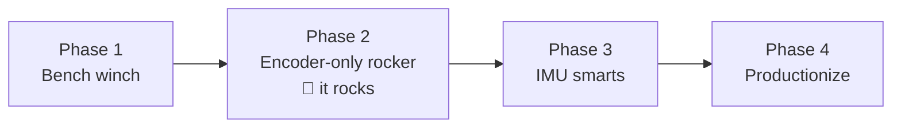

# 07 — Build Plan

Ordered to put the highest-risk, highest-learning steps first, and to reach "it rocks!"
as early as possible. Each phase has an exit test — don't move on until it passes.

## Phase 0 — Order & print (weekend 0)

Order the BOM ([doc 06](06-bill-of-materials.md)). While shipping: print the spool,
fairlead, and a first pod shell; measure your actual hammock (swing period with you in it —
phone stopwatch, 10 swings ÷ 10; height of the hammock edge; distance to the railing) and
sanity-check against [doc 01](01-system-overview.md).

## Phase 1 — Bench winch (weekend 1–2)

Assemble motor + driver + ESP32 + current sensor (+ solder the IMU in now, use it later)
in the pod shell, powered by the PD trigger.

Build the firmware skeleton: encoder readout, 20 kHz PWM, current ADC, the web dashboard
with live plots, and **tension mode** (the light-fishing-reel-drag behavior).

**Exit test:** with the pod strapped to a table edge and the line tied off across the room,
you can pull line out by hand and it always resists with a smooth, constant, gentle tension
— in every state, including after abuse (yank it, slack it, hold it). Calibrations done:
counts→mm, current→newtons (hang known weights over the fairlead). Firmware
current/speed/stroke clamps demonstrably trip.

## Phase 2 — Encoder-only rocker 🎉 (weekend 2–3)

The payoff phase. Build the sandbag pendulum (20 kg jug hung at L ≈ 1.2 m from a
broomstick between two chairs), strap the pod to the jug, anchor the line to something
solid, and implement the pump state machine from [doc 05](05-firmware-and-control.md)
using **encoder-only** sensing.

Then graduate to the real hammock on the balcony — pod strapped to the hammock edge,
anchor strap around a railing baluster — first with the sandbag *in* the hammock, then a
consenting adult, at half-force, kill switch within reach.

**Exit test:** hammock with occupant reaches and holds the amplitude setpoint within ~10
cycles; pulls feel like a gentle push, not a tug; the pod doesn't nod or slap the hammock
under motor torque (fix the strap geometry now if it does); grabbing the hammock mid-cycle
or stopping it dead ends in a soft FAULT/re-seed, never a lurch; a full session runs off
the power bank; the noise level at head height is acceptable to the occupant (if not — see
the re-housing escape hatch in [doc 02](02-motor-and-winch.md), and try TPU isolation
first).

*You now have a working product. Phases 3–4 are refinement.*

## Phase 3 — IMU smarts (weekend 4)

Firmware only — the IMU is already in the box. Add the low-pass filtering, IMU-seeded
startup (no frequency sweep from dead-still), amplitude-from-gyro on the dashboard, and
occupancy-change auto-stop (someone climbing in/out halts pumping within a cycle).

**Exit test:** startup from a dead-still hammock with no sweep hunting; simulated IMU
failure (unplug it) degrades gracefully to encoder-only; climbing out stops pumping within
one cycle.

## Phase 4 — Productionize (ongoing)

- Pod shell v2 informed by v1: better strap slots, quieter walls, drip shield, battery
  gauge on the dashboard, tidy line-fuse link at the anchor.
- Quality-of-life: amplitude presets on the dashboard, auto-stop timer ("rock me for
  20 minutes"), a lull-then-resume "sleep mode."
- Optional v2 hardware: integrated 3S pack for a slimmer pod
  ([doc 04](04-electronics-and-power.md)), load-cell tension sensing, BLDC/FOC drive for
  near-silence.

## Risk register (what's most likely to bite, and the planned answer)

| Risk | Likelihood | Mitigation |
|---|---|---|
| Slack-line snap loads | High (until tuned) | `T_idle` floor, pay-out velocity clamp, slack-detect + slow re-tension ([doc 05](05-firmware-and-control.md)) |
| Pod nods/slaps hammock under motor torque | High (first strap attempt) | Two-point strap ~10 cm apart, fairlead between/below strap points, snug girth hitch ([doc 02](02-motor-and-winch.md)) |
| Motor noise annoys the very person relaxing | Medium–high (it's at your hip) | Helical pinion, 20 kHz PWM, TPU isolation grommets, thick enclosure walls; escape hatch: re-house the same electronics railing-side |
| Power bank trips on current peaks | Medium | Firmware `I_max` ≤ bank rating, bulk caps, 45W+ bank if needed ([doc 04](04-electronics-and-power.md)) |
| Pull feels jerky | Medium | Force ramps first; bungee-parallel section at the anchor as mechanical fallback ([doc 03](03-sensing-and-tether.md)) |
| IMU drowned in motor vibration | Low | 0.45 Hz signal vs >50 Hz noise — low-pass filter + foam mounting ([doc 03](03-sensing-and-tether.md)) |
| Hammock fabric stressed at the strap | Low | Girth hitch spreads load; pad on ultralight nylon ([doc 02](02-motor-and-winch.md)) |
| Balcony neighbors ask what on earth that is | Certain | Show them the dashboard |
