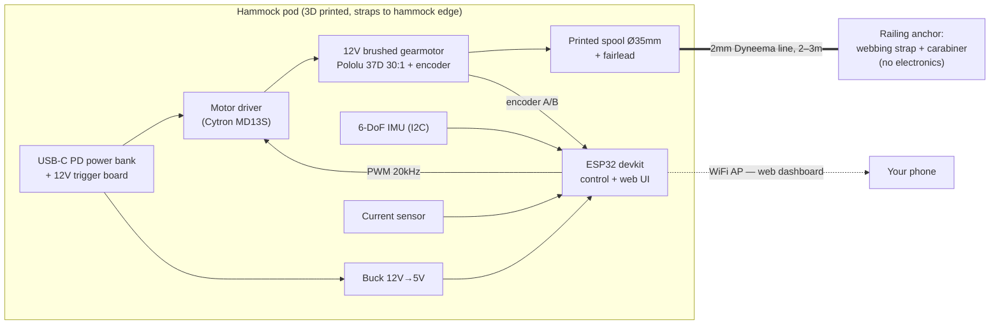

# HammockPro — Design Research & Build Plan

A self-contained, USB-rechargeable pod that clips onto any hammock and rocks it
indefinitely by winching a tether against a fixed anchor point, in resonance with the
hammock's natural pendulum motion.

This documentation is a research assignment result: it covers the physics, the component
choices (with specific part recommendations), the design trade-offs, and a phased build
plan that gets to a working rocker as early as possible.

## Reading order

| Doc | What's in it |
|---|---|
| [01 — System Overview](01-system-overview.md) | The physics of pumping a pendulum, system architecture, key design decisions and why |
| [02 — Motor & Winch](02-motor-and-winch.md) | Force/speed/torque math, **which motor to buy**, motor driver, spool and pod mechanics |
| [03 — Sensing & Tether](03-sensing-and-tether.md) | How the swing is sensed (encoder + onboard IMU), **which pull line to buy**, the anchor |
| [04 — Electronics & Power](04-electronics-and-power.md) | ESP32, IMU, single-battery USB-rechargeable power, wiring diagram, weight budget |
| [05 — Firmware & Control](05-firmware-and-control.md) | The control algorithm, phase detection, state machine, tuning |
| [06 — Bill of Materials](06-bill-of-materials.md) | Everything to order, with approximate prices |
| [07 — Build Plan](07-build-plan.md) | Phased milestones with test criteria — derisked order of operations |
| [08 — Safety](08-safety.md) | Force limits, mechanical fuse, battery, anchoring — read before v1 touches a human |

## Executive summary — the recommended design

Everything lives in **one pod, with one battery,** strapped to the hammock edge. The
railing side is completely passive: a webbing loop and a carabiner.

Because the pod rides on the hammock, the IMU is on the swinging body (as your original
concept wanted) *and* sits centimeters from the ESP32 — so it connects over plain I2C, no
cable run, no radio link, no second battery. One USB-C port charges everything.

### Headline recommendations (details and math in the linked docs)

1. **Motor:** [Pololu 37D 30:1 12V gearmotor with 64 CPR encoder](https://www.pololu.com/category/116/37d-metal-gearmotors)
   (helical-pinion version for quietness — the motor now rides near the occupant, so this
   matters doubly). Budget alternative: JGB37-520 12V ~330 RPM with encoder (~$15). Full
   reasoning in [doc 02](02-motor-and-winch.md).
2. **Pull line:** 2 mm Dyneema cord — dumb rope, no conductors, since nothing on the
   anchor side needs power or data. See [doc 03](03-sensing-and-tether.md).
3. **Big derisking insight:** the winch encoder alone can rock the hammock. With the line
   under light tension, line pay-out *is* hammock displacement — a position sensor with
   sub-mm resolution you get for free. Build and tune with encoder-only control first
   (Phase 2 of the [build plan](07-build-plan.md)); the IMU then layers on smarter startup,
   amplitude sensing, and climb-in/out detection.
4. **Avoid worm-gear motors and very high gear ratios.** The hammock must be able to pull
   line back out on the away-swing; a non-backdrivable gearbox turns a power loss into a
   hard jerk. This is the single most important motor-selection constraint.
5. **Power:** a small USB-C PD power bank inside the pod + a 12 V PD trigger board — you
   get a certified BMS, USB-C recharging, and a swappable battery for free. An integrated
   3S Li-ion pack is the v2 slimming path. See [doc 04](04-electronics-and-power.md).
6. **Accepted trade-offs of the hammock-mounted pod** (vs. mounting the same box on the
   railing): ~600–700 g rides on the hammock edge, and the motor runs ~0.5 m from the
   occupant instead of ~2 m. Both are manageable ([doc 02](02-motor-and-winch.md) covers
   noise mitigation), and the electronics are position-agnostic — the identical box can be
   re-housed on the railing later if the noise proves annoying. What you gain: one battery,
   one enclosure, no radio protocol, a passive $6 anchor instead of an engineered clamp,
   and a device that works on any hammock anchored to any solid object.

### What this costs

Roughly **$120–150** with the recommended parts, or **$65–85** with budget substitutions,
assuming you already own a suitable USB-C power bank. Full list in
[doc 06](06-bill-of-materials.md).

### What to expect

- Hammock + occupant behaves as a pendulum with a ~2–2.5 s period; sustaining a pleasant
  ±10° rock requires injecting only **~2–5 J per cycle** — a gentle 20–40 N tug over
  ~15–20 cm, once per swing. This is squarely hobby-gearmotor territory.
- Power draw is modest: ~3–6 W average while rocking. A 10,000 mAh power bank runs it for
  an afternoon-plus.
- The genuinely hard parts are (a) mechanical: strapping the pod so it doesn't nod under
  motor torque, and slack management on the line, and (b) control: paying line out smoothly
  so the away-swing never snags. All have known solutions described in these docs.
