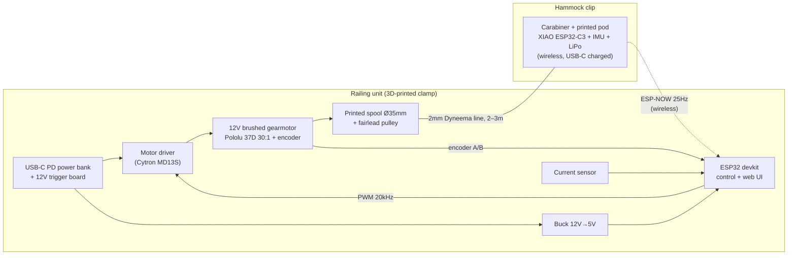

# HammockPro — Design Research & Build Plan

A railing-mounted, USB-rechargeable winch that rocks a hammock indefinitely by pulling a
tether in resonance with the hammock's natural pendulum motion.

This documentation is a research assignment result: it covers the physics, the component
choices (with specific part recommendations), the places where your initial concept should
be adjusted, and a phased build plan that gets to a working rocker as early as possible.

## Reading order

| Doc | What's in it |
|---|---|
| [01 — System Overview](01-system-overview.md) | The physics of pumping a pendulum, system architecture, key design decisions and why |
| [02 — Motor & Winch](02-motor-and-winch.md) | Force/speed/torque math, **which motor to buy**, motor driver, spool and gearbox guidance |
| [03 — Sensing & Tether](03-sensing-and-tether.md) | The IMU clip (wired vs. wireless — read this before buying cable), **which pull line and cable to buy** |
| [04 — Electronics & Power](04-electronics-and-power.md) | ESP32 choice, USB-rechargeable power options, wiring diagram |
| [05 — Firmware & Control](05-firmware-and-control.md) | The control algorithm, phase detection, state machine, tuning |
| [06 — Bill of Materials](06-bill-of-materials.md) | Everything to order, with approximate prices |
| [07 — Build Plan](07-build-plan.md) | Phased milestones with test criteria — derisked order of operations |
| [08 — Safety](08-safety.md) | Force limits, mechanical fuse, battery, mounting — read before v1 touches a human |

## Executive summary — the recommended design

### Headline recommendations (details and math in the linked docs)

1. **Motor:** [Pololu 37D 30:1 12V gearmotor with 64 CPR encoder](https://www.pololu.com/category/116/37d-metal-gearmotors)
   (helical-pinion version for quietness). Budget alternative: JGB37-520 12V ~330 RPM with
   encoder (~$15). Full reasoning in [doc 02](02-motor-and-winch.md).
2. **Pull line:** 2 mm Dyneema cord — not a copper cable. **Don't put the data/power
   conductors in the load path.** See [doc 03](03-sensing-and-tether.md).
3. **Sensor clip:** make it **wireless** (ESP-NOW from a Seeed XIAO ESP32-C3 + IMU + small
   LiPo, USB-C rechargeable). A wired clip is workable (UART, not I2C, over the distance)
   and is documented as the alternative — but wireless removes the hardest mechanical
   problem in the whole project.
4. **Big derisking insight:** you can get a working rocker **before building the clip at
   all**. If the line is kept under light tension, the winch encoder *is* a hammock position
   sensor — line pay-out equals hammock displacement. Build the "sensorless" version first
   (Phase 2 in the [build plan](07-build-plan.md)), add the IMU clip later for amplitude
   accuracy and robustness.
5. **Power:** for v1, a USB-C PD power bank + a 12 V PD trigger board — you get a certified
   BMS, USB-C recharging, and a removable battery for free. An integrated 3S Li-ion pack is
   the v2 upgrade path. See [doc 04](04-electronics-and-power.md).
6. **Avoid worm-gear motors and very high gear ratios.** The hammock must be able to pull
   line back out on the away-swing; a non-backdrivable gearbox turns a power loss into a
   hard jerk. This is the single most important motor-selection constraint.

### What this costs

Roughly **$120–160** with the recommended parts, or **$70–90** with budget substitutions,
assuming you already own a USB-C power bank. Full list in [doc 06](06-bill-of-materials.md).

### What to expect

- Hammock + occupant behaves as a pendulum with a ~2–2.5 s period; sustaining a pleasant
  ±10° rock requires injecting only **~2–5 J per cycle** — a gentle 20–40 N tug over
  ~15–20 cm, once per swing. This is squarely hobby-gearmotor territory.
- Power draw is modest: ~3–6 W average while rocking. A 10,000 mAh power bank runs it for
  an afternoon-plus.
- The genuinely hard parts are (a) mechanical: strain relief and slack management on the
  line, and (b) control: paying line out smoothly so the away-swing never snags. Both have
  known solutions described in these docs.
